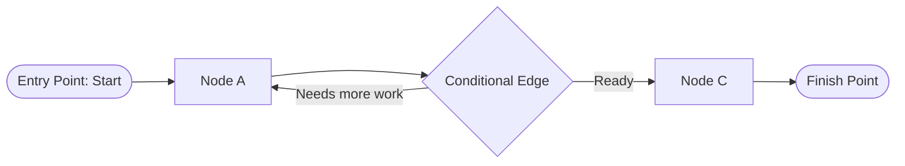

# graphflow 🦀⛓️

[](https://crates.io/)
[](LICENSE)
[](https://www.rust-lang.org/)
[]()

> A lightweight, LangGraph-inspired stateful workflow engine for Rust.

`graphflow` enables you to coordinate multi-step workflows, autonomous AI agent loops, and state machines with ease. Model your processes as directed graphs with nodes (actions), static edges (transitions), and conditional edges (dynamic routing and decision making).

---

## 📑 Table of Contents

- [Features](#-features)
- [How It Works](#-how-it-works)
- [Installation](#-installation)
- [Quickstart Tutorial](#-quickstart-tutorial)
- [Core Concepts](#-core-concepts)
  - [1. Shared State (`T`)](#1-shared-state-t)
  - [2. Nodes (`NodeFunction<T>`)](#2-nodes-nodefunctiont)
  - [3. Static Edges](#3-static-edges)
  - [4. Conditional Edges (`BranchFunction<T>`)](#4-conditional-edges-branchfunctiont)
  - [5. Entry and Finish Points](#5-entry-and-finish-points)
  - [6. Compilation & Validation](#6-compilation--validation)
- [Examples](#-examples)
  - [Example 1: Cyclic Loop with Dynamic Routing](#example-1-cyclic-loop-with-dynamic-routing)
  - [Example 2: Autonomous LLM Agent Loop](#example-2-autonomous-llm-agent-loop)
- [API Reference](#-api-reference)
- [Graph Validation Rules](#-graph-validation-rules)
- [Running Tests & Examples](#-running-tests--examples)
- [License](#-license)

---

## ✨ Features

- ⚡ **Zero Heavy Dependencies**: Pure Rust with standard library hash maps and function pointers.
- 🔒 **Type-Safe State Machine**: Graph execution is generic over your custom state struct `T`.
- 🔀 **Dynamic Branching & Decision Routing**: Prioritizes conditional edges to route execution based on runtime state inspection.
- 🔄 **Cycles & Loops**: Seamlessly supports looping workflows for agent retries, human-in-the-loop flows, or iterative optimization.
- 🛡️ **Pre-Execution Graph Validation**: Verifies entry/finish nodes and edge integrity during `.compile()` before any execution begins.
- 🛠️ **Fluent Builder API**: Intuitive method chaining to construct workflows cleanly.

---

## 🧠 How It Works

A `graphflow` graph consists of:
1. **Nodes**: Functions that mutate state `&mut T`.
2. **Edges**: Deterministic paths connecting one node to the next.
3. **Conditional Edges**: Decision functions that inspect `&T` and dynamically choose the next target node.



During execution:
- Execution begins at the configured `entry_point`.
- At each node, the corresponding function executes and mutates the shared state.
- If the current node is the `finish_point`, execution terminates successfully.
- Otherwise, if a **conditional edge** exists for the current node, it is evaluated first.
- If no conditional edge exists, the standard static edge is followed.

---

## 📦 Installation

Add `graphflow` to your `Cargo.toml`:

```toml
[dependencies]
graphflow = "0.1.0"
```

Or add it from your local workspace / git repository:

```toml
[dependencies]
graphflow = { git = "https://github.com/vesal-j/graphflow" }
```

---

## 🚀 Quickstart Tutorial

Here is a complete, minimal working example in 5 steps:

```rust
use graphflow::Graph;
use std::fmt::Error;

// Step 1: Define your state
struct WorkflowState {
    pub message: String,
    pub step_count: usize,
}

// Step 2: Define your node functions
fn step_one(state: &mut WorkflowState) -> Result<(), Error> {
    state.message.push_str("Hello");
    state.step_count += 1;
    Ok(())
}

fn step_two(state: &mut WorkflowState) -> Result<(), Error> {
    state.message.push_str(" World!");
    state.step_count += 1;
    Ok(())
}

fn main() -> Result<(), Box<dyn std::error::Error>> {
    // Step 3: Build the graph
    let mut graph: Graph<WorkflowState> = Graph::new();

    graph
        .add_node("first".to_string(), step_one)
        .add_node("second".to_string(), step_two)
        .add_edge("first".to_string(), "second".to_string())
        .set_entry_point("first".to_string())
        .set_finish_point("second".to_string());

    // Step 4: Compile and validate the graph
    let compiled = graph.compile().map_err(|err| format!("Graph error: {err}"))?;

    // Step 5: Execute the graph with initial state
    let state = WorkflowState {
        message: String::new(),
        step_count: 0,
    };

    compiled.invoke(state)?;

    Ok(())
}
```

---

## 🧩 Core Concepts

### 1. Shared State (`T`)

The state represents the central blackboard or context of your pipeline. Every node receives a mutable reference (`&mut T`), allowing it to update fields, append messages, or increment counters.

```rust
struct AgentState {
    user_prompt: String,
    tool_results: Vec<String>,
    iteration: usize,
}
```

### 2. Nodes (`NodeFunction<T>`)

Nodes perform the discrete units of computation. A node function signature is:

```rust
pub type NodeFunction<T> = fn(&mut T) -> Result<(), std::fmt::Error>;
```

Example:
```rust
fn execute_tool(state: &mut AgentState) -> Result<(), std::fmt::Error> {
    state.tool_results.push("Tool output".to_string());
    Ok(())
}
```

### 3. Static Edges

Static edges create an unconditional transition from node `from` to node `to`:

```rust
graph.add_edge("fetch_data".to_string(), "process_data".to_string());
```

### 4. Conditional Edges (`BranchFunction<T>`)

Conditional edges evaluate the current state and return the name of the next node:

```rust
pub type BranchFunction<T> = fn(&T) -> String;
```

> **Note:** If a node has both a static edge and a conditional edge, the **conditional edge takes precedence**.

```rust
graph.add_conditional_edge("evaluate".to_string(), |state| {
    if state.iteration < 3 {
        "retry".to_string()
    } else {
        "finish".to_string()
    }
});
```

### 5. Entry and Finish Points

Every graph must specify where execution starts and where it ends:

```rust
graph.set_entry_point("start_node".to_string());
graph.set_finish_point("final_node".to_string());
```

### 6. Compilation & Validation

Calling `.compile()` verifies graph integrity before executing:

```rust
let compiled = graph.compile()?;
```

If any referenced node is missing or entry/finish points are undefined, `compile` returns a descriptive `Err(String)`.

---

## 💡 Examples

### Example 1: Cyclic Loop with Dynamic Routing

In this example, an integer state is incremented and doubled in a loop until it reaches a threshold:

```rust
use graphflow::Graph;

struct CounterState {
    count: usize,
}

fn main() -> Result<(), Box<dyn std::error::Error>> {
    let mut graph: Graph<CounterState> = Graph::new();

    graph
        .add_node("increment".to_string(), |state| {
            state.count += 1;
            println!("Count incremented to {}", state.count);
            Ok(())
        })
        .add_node("double".to_string(), |state| {
            state.count *= 2;
            println!("Count doubled to {}", state.count);
            Ok(())
        })
        .add_node("finish".to_string(), |state| {
            println!("Done! Final count: {}", state.count);
            Ok(())
        })
        .add_edge("increment".to_string(), "double".to_string())
        .add_conditional_edge("double".to_string(), |state| {
            if state.count < 10 {
                "increment".to_string() // loop back
            } else {
                "finish".to_string()    // exit loop
            }
        })
        .set_entry_point("increment".to_string())
        .set_finish_point("finish".to_string());

    let compiled = graph.compile().map_err(|e| format!("Validation error: {e}"))?;
    compiled.invoke(CounterState { count: 1 })?;

    Ok(())
}
```

Run this example directly from the repository:
```bash
cargo run --example counter_loop
```

---

### Example 2: Autonomous LLM Agent Loop

Model a classic AI agent loop:
1. **Plan**: Formulate plan or analyze prompt.
2. **Search / Tool**: Gather external information.
3. **Route**: Decide whether to call tools again or synthesize the answer.
4. **Synthesize**: Produce final response.

```rust
use graphflow::Graph;

struct AgentState {
    query: String,
    iterations: usize,
    max_iterations: usize,
    has_sufficient_context: bool,
    response: Option<String>,
}

fn plan(state: &mut AgentState) -> Result<(), std::fmt::Error> {
    println!("[Plan] Planning query: '{}'", state.query);
    Ok(())
}

fn search_tools(state: &mut AgentState) -> Result<(), std::fmt::Error> {
    state.iterations += 1;
    println!("[Tool] Running search (iteration {})...", state.iterations);
    if state.iterations >= 2 {
        state.has_sufficient_context = true;
    }
    Ok(())
}

fn route_decision(state: &AgentState) -> String {
    if state.has_sufficient_context || state.iterations >= state.max_iterations {
        "synthesize".to_string()
    } else {
        "search".to_string()
    }
}

fn synthesize(state: &mut AgentState) -> Result<(), std::fmt::Error> {
    println!("[Synthesize] Synthesizing final response...");
    state.response = Some(format!("Answer for: {}", state.query));
    Ok(())
}

fn main() -> Result<(), Box<dyn std::error::Error>> {
    let mut graph: Graph<AgentState> = Graph::new();

    graph
        .add_node("plan".to_string(), plan)
        .add_node("search".to_string(), search_tools)
        .add_node("synthesize".to_string(), synthesize)
        .add_edge("plan".to_string(), "search".to_string())
        .add_conditional_edge("search".to_string(), route_decision)
        .set_entry_point("plan".to_string())
        .set_finish_point("synthesize".to_string());

    let compiled = graph.compile().map_err(|e| format!("Compile error: {e}"))?;

    let state = AgentState {
        query: "What is the capital of Rustland?".to_string(),
        iterations: 0,
        max_iterations: 3,
        has_sufficient_context: false,
        response: None,
    };

    compiled.invoke(state)?;
    Ok(())
}
```

Run this example:
```bash
cargo run --example llm_agent_workflow
```

### Example 3: Parallel Tasks with Pregel Execution (Fork-Join)

Execute multiple tasks concurrently in a single Pregel superstep using scoped threads with a synchronization barrier before the next step:

```rust
use graphflow::Graph;
use std::sync::{Arc, Mutex};

#[derive(Debug, Clone)]
struct SearchState {
    query: String,
    results: Arc<Mutex<Vec<String>>>,
}

fn main() -> Result<(), Box<dyn std::error::Error>> {
    let mut graph: Graph<SearchState> = Graph::new();

    graph
        .add_node("start".to_string(), |_| Ok(()))
        .add_node("search_web".to_string(), |s| {
            s.results.lock().unwrap().push("Web Result".to_string());
            Ok(())
        })
        .add_node("search_db".to_string(), |s| {
            s.results.lock().unwrap().push("DB Result".to_string());
            Ok(())
        })
        .add_node("aggregate".to_string(), |s| {
            println!("Collected {} results!", s.results.lock().unwrap().len());
            Ok(())
        })
        .add_node("finish".to_string(), |_| Ok(()))
        // Fan-out: triggers search_web and search_db concurrently in the same superstep
        .add_parallel_edge(
            "start".to_string(),
            vec!["search_web".to_string(), "search_db".to_string()],
        )
        // Fan-in: both workers route to aggregate at the barrier
        .add_edge("search_web".to_string(), "aggregate".to_string())
        .add_edge("search_db".to_string(), "aggregate".to_string())
        .add_edge("aggregate".to_string(), "finish".to_string())
        .set_entry_point("start".to_string())
        .set_finish_point("finish".to_string());

    let compiled = graph.compile().unwrap();

    let state = SearchState {
        query: "Pregel in Rust".to_string(),
        results: Arc::new(Mutex::new(Vec::new())),
    };

    compiled.invoke_pregel(state)?;
    Ok(())
}
```

Run this example:
```bash
cargo run --example parallel_pregel
```

---

## 📖 API Reference

### `Graph<T>`

The builder struct used to declare workflow topology.

| Method | Signature | Description |
| :--- | :--- | :--- |
| `new()` | `pub fn new() -> Self` | Creates an empty graph builder. |
| `default()` | `fn default() -> Self` | Equivalent to `Graph::new()`. |
| `add_node` | `&mut Self -> &mut Self` | Registers a named node function. |
| `add_edge` | `&mut Self -> &mut Self` | Adds a directional edge between two nodes (supports comma-separated targets). |
| `add_parallel_edge` | `&mut Self, from: String, targets: Vec<String> -> &mut Self` | Adds a fan-out transition activating multiple parallel tasks in the next superstep. |
| `add_conditional_edge` | `&mut Self -> &mut Self` | Adds a dynamic branching edge evaluated via `BranchFunction<T>` (can return comma-separated targets for parallel fan-out). |
| `set_entry_point` | `&mut Self -> &mut Self` | Sets the start node name (or comma-separated names for parallel entry). |
| `set_finish_point` | `&mut Self -> &mut Self` | Sets the termination node name. |
| `compile` | `&mut Self -> Result<CompiledGraph<T>, String>` | Validates the graph structure and returns an executable `CompiledGraph`. |

### `CompiledGraph<T>`

The validated, immutable graph ready for execution.

| Method | Signature | Description |
| :--- | :--- | :--- |
| `invoke` | `&self, state: T -> Result<(), std::fmt::Error>` | Executes the graph using the Pregel Bulk Synchronous Parallel execution model. |
| `invoke_pregel` | `&self, state: T -> Result<(), std::fmt::Error>` | Explicit alias for `invoke` executing via the Pregel model. |
| `invoke_with_state` | `&self, state: T -> Result<T, std::fmt::Error>` | Executes via Pregel and directly returns the final mutated state `Result<T, Error>`. |

---

## 🛡️ Graph Validation Rules

When `.compile()` is invoked, `graphflow` ensures:
1. **Entry Point Configured**: An entry point must be provided (`"Entry point is not set"`).
2. **Finish Point Configured**: A finish point must be provided (`"Finish point is not set"`).
3. **Valid Entry Node**: Entry point (or all comma-separated entry points) must correspond to added nodes (`"Entry point '<name>' does not exist"`).
4. **Valid Finish Node**: Finish point must correspond to an added node (`"Finish point '<name>' does not exist"`).
5. **Edge Integrity**: For every edge `from -> to`:
   - `from` must exist (`"Edge source '<name>' does not exist"`).
   - all targets in `to` must exist (`"Edge target '<name>' does not exist"`).
6. **Conditional Edge Integrity**: For every conditional edge `from`:
   - `from` must exist (`"Conditional edge source '<name>' does not exist"`).

---

## 🧪 Running Tests & Examples

To run the complete test suite (39 tests):

```bash
cargo test
```

To run all bundled examples:

```bash
# Run counter loop example
cargo run --example counter_loop

# Run LLM agent workflow example
cargo run --example llm_agent_workflow

# Run Pregel parallel Fork-Join example
cargo run --example parallel_pregel
```

---

## 📜 License

This project is licensed under the [MIT License](LICENSE).
