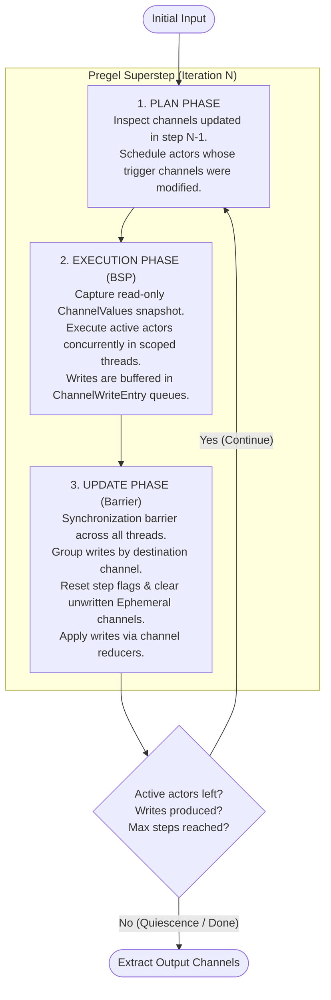

# Pregel Engine Architecture ⚙️

This directory contains the implementation of the **Pregel / Bulk Synchronous Parallel (BSP)** execution engine for `graphflow` (`rustchain`), modeled after [LangGraph's](https://github.com/langchain-ai/langgraph) core runtime.

---

## 📑 Table of Contents

- [Overview](#-overview)
- [How It Works: The 3-Phase Superstep](#-how-it-works-the-3-phase-superstep)
- [Core Primitives](#-core-primitives)
  - [1. Channels](#1-channels)
  - [2. Actors (`PregelNode` & `NodeBuilder`)](#2-actors-pregelnode--nodebuilder)
  - [3. Engine (`Pregel`)](#3-engine-pregel)
- [Step-by-Step Execution Lifecycle](#-step-by-step-execution-lifecycle)
- [Channel Semantics & Types](#-channel-semantics--types)
  - [`LastValue<V>`](#lastvaluev)
  - [`EphemeralValue<V>`](#ephemeralvaluev)
  - [`Topic<V>`](#topicv)
  - [`BinaryOperatorAggregate<V>`](#binaryoperatoraggregatev)
- [Code Examples](#-code-examples)
  - [Example 1: Single Node](#example-1-single-node)
  - [Example 2: Multi-Node Pipeline with Mixed Channels](#example-2-multi-node-pipeline-with-mixed-channels)
  - [Example 3: PubSub Topic Aggregation](#example-3-pubsub-topic-aggregation)
  - [Example 4: Stateful Reducer (BinaryOperatorAggregate)](#example-4-stateful-reducer-binaryoperatoraggregate)
  - [Example 5: Cycles & Automatic Termination](#example-5-cycles--automatic-termination)
- [Comparison: `Pregel` vs Traditional `CompiledGraph`](#-comparison-pregel-vs-traditional-compiledgraph)
- [Concurrency & Memory Model](#-concurrency--memory-model)

---

## 🧠 Overview

In traditional workflow engines, nodes directly mutate a single monolithic state object (`&mut State`) or transition along hardcoded graph edges. This introduces lock contention, race conditions during parallel node execution, and rigid coupling.

The **Pregel BSP model** replaces this with two decoupled concepts:
1. **Channels**: Named, independent storage cells that define their own aggregation and persistence rules.
2. **Actors (`PregelNode`)**: Autonomous execution units that subscribe to channels, read immutable snapshots, compute concurrently, and emit buffered writes.

Nodes do not know about other nodes; they only read from and write to channels. Workflow topology and edge transitions are **emergent from data flow**.

---

## 🔄 How It Works: The 3-Phase Superstep

Every iteration of the execution loop is called a **Superstep**. Each superstep executes three strictly separated phases:



---

## 🧩 Core Primitives

### 1. Channels
Channels implement the `Channel` trait (`src/pregel/channel.rs`):
- Manage an internal value of type `V: Clone + Send + Sync + 'static`.
- Maintain an `is_updated()` flag indicating whether a write was committed in the most recent superstep.
- Provide a `step_reset()` hook called at the start of Phase 3 to clear ephemeral values and reset update flags.
- Provide an `update(Vec<Box<dyn Any>>)` method to apply a batch of writes using the channel's update strategy.
- Provide `get_boxed()` to create an immutable clone for snapshotting.
- Provide `clone_channel()` to allow isolated, thread-safe graph executions.

### 2. Actors (`PregelNode` & `NodeBuilder`)
Defined in `src/pregel/node.rs`:
- **`triggers`**: A list of channel names. If **any** of these channels was updated in the prior step, this node is scheduled to run.
- **`read_channels`**: The channels whose data is passed into the node function.
- **`write_targets`**: The destination channels that receive the node's output.
- **`NodeBuilder`**: A fluent API designed to match LangGraph Python syntax:
  ```rust
  let node = NodeBuilder::new("worker")
      .subscribe_only("input_ch")
      .do_pure(|val: String| format!("{val}!"))
      .write_to("output_ch");
  ```

### 3. Engine (`Pregel`)
Defined in `src/pregel/engine.rs`:
- Holds the registry of nodes, channels, input channels, output channels, and `max_steps`.
- Executes `invoke_values(ChannelValues)` by creating an isolated channel state clone, running the superstep loop until quiescence or `max_steps`, and extracting the configured output channels.

---

## ⏱️ Step-by-Step Execution Lifecycle

1. **Invocation Initialization**:
   - `Pregel::invoke_values` clones the registered channels to ensure re-entrancy and thread safety.
   - The initial input values are injected into the input channels using their `.update()` methods, setting their `is_updated()` flags to `true`.

2. **Phase 1: Plan**:
   - The engine iterates through all nodes in `self.nodes`.
   - If any channel in `node.triggers` has `channel.is_updated() == true`, the node is added to `active_nodes`.
   - **Quiescence Check**: If `active_nodes` is empty, execution terminates immediately.

3. **Phase 2: Execution**:
   - The engine constructs a read-only snapshot (`ChannelValues`) containing cloned boxed values of all channels holding data.
   - If `active_nodes.len() == 1`, the node executes on the current thread.
   - If `active_nodes.len() > 1`, execution fans out into `std::thread::scope`, spawning worker threads for each active node.
   - **BSP Isolation**: Nodes receive `&ChannelValues`. They cannot see channel writes produced by other nodes running in the same superstep.
   - All produced `ChannelWriteEntry` instances are gathered into `all_writes`.
   - **Quiescence Check**: If `all_writes` is empty, execution finishes and the loop breaks without wiping unwritten ephemeral channels.

4. **Phase 3: Update**:
   - Synchronization barrier: all threads must complete before this phase begins.
   - Writes are grouped by target channel: `HashMap<String, Vec<Box<dyn Any>>>`.
   - `channel.step_reset()` is called on every channel. For `EphemeralValue`, this clears the value to `None`.
   - `channel.update(writes)` is called for each channel that received writes, updating the value and marking `is_updated = true`.
   - Superstep counter increments. If `step >= max_steps`, returns `PregelError::MaxStepsExceeded`.
   - Control loops back to Phase 1.

---

## 📦 Channel Semantics & Types

### `LastValue<V>`
- **Behavior**: Stores the most recent write sent to the channel.
- **Persistence**: Retains its value across all subsequent supersteps until explicitly overwritten by a new write.
- **Use case**: Standard state variables, counters, configuration parameters, and long-lived model outputs.

### `EphemeralValue<V>`
- **Behavior**: Stores a value for **exactly one superstep**.
- **Persistence**: Automatically resets to `None` in the subsequent superstep if no new write is directed to it.
- **Use case**: Event triggers, user inputs, signals, routing decisions, and transient messages between specific stages.

### `Topic<V>`
- **Behavior**: PubSub queue that collects all writes produced by any number of nodes in a superstep.
- **Options**:
  - `accumulate: true` — keeps all items appended across the entire run (`Vec<V>`).
  - `accumulate: false` — clears previous items at each step, keeping only writes from the current step.
  - `dedup: true` — deduplicates values to prevent redundant processing.
- **Use case**: Log accumulation, fan-in aggregators, multi-agent message feeds, and stream gathering.

### `BinaryOperatorAggregate<V>`
- **Behavior**: Persistent value that applies a binary reducer closure `fn(Option<V>, V) -> V` to each incoming update.
- **Use case**: Running totals, histogram counters, string concatenations (`"a | b"`), and state folding.

---

## 💻 Code Examples

### Example 1: Single Node
```rust
use graphflow::pregel::{EphemeralValue, NodeBuilder, Pregel};

let node1 = NodeBuilder::new("node1")
    .subscribe_only("a")
    .do_pure(|x: String| format!("{x}{x}"))
    .write_to("b");

let mut app = Pregel::new();
app.add_channel("a", EphemeralValue::<String>::new());
app.add_channel("b", EphemeralValue::<String>::new());
app.add_node(node1);
app.set_input_channels(vec!["a"]);
app.set_output_channels(vec!["b"]);

let result: String = app.invoke_single("a", "foo".to_string(), "b").unwrap();
assert_eq!(result, "foofoo");
```

### Example 2: Multi-Node Pipeline with Mixed Channels
```rust
use graphflow::pregel::{ChannelValues, EphemeralValue, LastValue, NodeBuilder, Pregel};

// node1 reads ephemeral "a", writes to last-value "b"
let node1 = NodeBuilder::new("node1")
    .subscribe_only("a")
    .do_pure(|x: String| format!("{x}{x}"))
    .write_to("b");

// node2 triggers when "b" is updated, writes to ephemeral "c"
let node2 = NodeBuilder::new("node2")
    .subscribe_only("b")
    .do_pure(|x: String| format!("{x}{x}"))
    .write_to("c");

let mut app = Pregel::new();
app.add_channel("a", EphemeralValue::<String>::new());
app.add_channel("b", LastValue::<String>::new());
app.add_channel("c", EphemeralValue::<String>::new());
app.add_node(node1);
app.add_node(node2);
app.set_input_channels(vec!["a"]);
app.set_output_channels(vec!["b", "c"]);

let mut inputs = ChannelValues::new();
inputs.insert("a", "foo".to_string());
let out = app.invoke_values(inputs).unwrap();

assert_eq!(out.get::<String>("b").unwrap(), "foofoo");
assert_eq!(out.get::<String>("c").unwrap(), "foofoofoofoo");
```

### Example 3: PubSub Topic Aggregation
```rust
use graphflow::pregel::{ChannelValues, EphemeralValue, NodeBuilder, Pregel, Topic};

// node1 fans out to both "b" and "c"
let node1 = NodeBuilder::new("node1")
    .subscribe_only("a")
    .do_pure(|x: String| format!("{x}{x}"))
    .write_to("b")
    .write_to("c");

// node2 reads "b" and writes to "c"
let node2 = NodeBuilder::new("node2")
    .subscribe_only("b")
    .do_pure(|x: String| format!("{x}{x}"))
    .write_to("c");

let mut app = Pregel::new();
app.add_channel("a", EphemeralValue::<String>::new());
app.add_channel("b", EphemeralValue::<String>::new());
app.add_channel("c", Topic::<String>::new(true)); // accumulate across all steps
app.add_node(node1);
app.add_node(node2);
app.set_input_channels(vec!["a"]);
app.set_output_channels(vec!["c"]);

let mut inputs = ChannelValues::new();
inputs.insert("a", "foo".to_string());
let out = app.invoke_values(inputs).unwrap();

assert_eq!(out.get::<Vec<String>>("c").unwrap(), vec!["foofoo", "foofoofoofoo"]);
```

### Example 4: Stateful Reducer (BinaryOperatorAggregate)
```rust
use graphflow::pregel::{BinaryOperatorAggregate, ChannelValues, EphemeralValue, NodeBuilder, Pregel};

let reducer = |current: Option<String>, update: String| match current {
    Some(cur) => format!("{cur} | {update}"),
    None => update,
};

let node1 = NodeBuilder::new("node1")
    .subscribe_only("a")
    .do_pure(|x: String| format!("{x}{x}"))
    .write_to("b")
    .write_to("c");

let node2 = NodeBuilder::new("node2")
    .subscribe_only("b")
    .do_pure(|x: String| format!("{x}{x}"))
    .write_to("c");

let mut app = Pregel::new();
app.add_channel("a", EphemeralValue::<String>::new());
app.add_channel("b", EphemeralValue::<String>::new());
app.add_channel("c", BinaryOperatorAggregate::<String>::new(reducer));
app.add_node(node1);
app.add_node(node2);
app.set_input_channels(vec!["a"]);
app.set_output_channels(vec!["c"]);

let mut inputs = ChannelValues::new();
inputs.insert("a", "foo".to_string());
let out = app.invoke_values(inputs).unwrap();

assert_eq!(out.get::<String>("c").unwrap(), "foofoo | foofoofoofoo");
```

### Example 5: Cycles & Automatic Termination
```rust
use graphflow::pregel::{ChannelValues, EphemeralValue, NodeBuilder, Pregel};

// Loops by writing back to "value" until threshold is reached, then returns None
let cycle_node = NodeBuilder::new("example_node")
    .subscribe_only("value")
    .do_pure_option(|x: String| {
        if x.len() < 10 {
            Some(format!("{x}{x}"))
        } else {
            None // halting condition: skip write
        }
    })
    .write_to("value");

let mut app = Pregel::new();
app.add_channel("value", EphemeralValue::<String>::new());
app.add_node(cycle_node);
app.set_input_channels(vec!["value"]);
app.set_output_channels(vec!["value"]);

let mut inputs = ChannelValues::new();
inputs.insert("value", "a".to_string());

// Execution trace:
// Step 0: input "a" (len 1)
// Step 1: "a" -> "aa" (len 2)
// Step 2: "aa" -> "aaaa" (len 4)
// Step 3: "aaaa" -> "aaaaaaaa" (len 8)
// Step 4: "aaaaaaaa" -> "aaaaaaaaaaaaaaaa" (len 16)
// Step 5: len 16 >= 10 -> None (no writes produced, halts)
let out = app.invoke_values(inputs).unwrap();
assert_eq!(out.get::<String>("value").unwrap(), "aaaaaaaaaaaaaaaa");
```

---

## ⚖️ Comparison: `Pregel` vs Traditional `CompiledGraph`

| Dimension | Traditional `CompiledGraph<T>` | Pregel Engine (`Pregel`) |
| :--- | :--- | :--- |
| **State Storage** | Monolithic `Mutex<T>` | Multiple independent typed **Channels** |
| **Concurrency** | Threads contend on the same `Mutex<T>` lock | **Zero lock contention**: nodes receive read-only snapshots |
| **State Isolation** | Uncontrolled interleaved mutations | **BSP Isolation**: writes invisible until next superstep |
| **Routing Model** | Explicit edge strings (`"a -> b"`) | **Data-driven**: nodes trigger from channel updates |
| **Aggregation** | Manual in-place struct modification | Dedicated reducers (`Topic`, `BinaryOperatorAggregate`) |
| **Transient Signals** | Unsupported (all data stays in `T`) | First-class `EphemeralValue<V>` channels |
| **Cycle Handling** | Branch functions returning string names | Natural data-flow cycles halting on quiescence |
| **Termination** | Reaching an explicit `finish_point` | Quiescence (no active triggers), max steps, or stop |

---

## 🔒 Concurrency & Memory Model

- **Thread-Safety (`Send + Sync`)**: `Pregel`, all channel implementations, and `PregelNode` satisfy `Send + Sync`. An `Arc<Pregel>` can safely be shared across threads to serve concurrent requests.
- **Re-entrant Invocations**: Calling `.invoke_values()` does not mutate the `Pregel` instance. It clones the registered channels at invocation start, guaranteeing that parallel invocations remain isolated.
- **Scoped Threading**: Parallel actors run inside `std::thread::scope`, eliminating heap allocations for thread handles and avoiding detached background thread leaks.
- **Zero Heavyweight Dependencies**: Pure standard library implementation with zero third-party runtime crates required.
